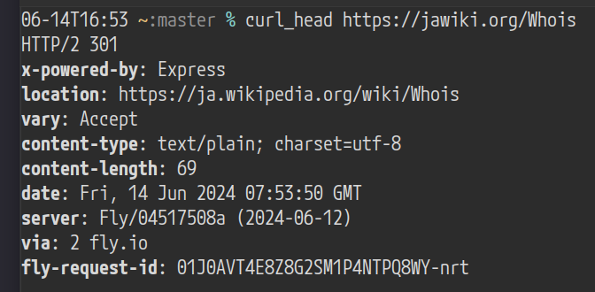

HTTP redirector deployable as a Fly app.

## Configuration

Configuration is done using environment variables (and optionally using a file).

- `FORWARD_CONFIG` - main config (see below)
- `PORT` - port number

If `config.json` is present, it precedes over `FORWARD_CONFIG`. See `config-sample.json` for a sample.

## Use

`npm ci && FORWARD_CONFIG='{rules: {"*": https://en.wikipedia.org}}' PORT=3001 npm start`

## Test

`npm test`

